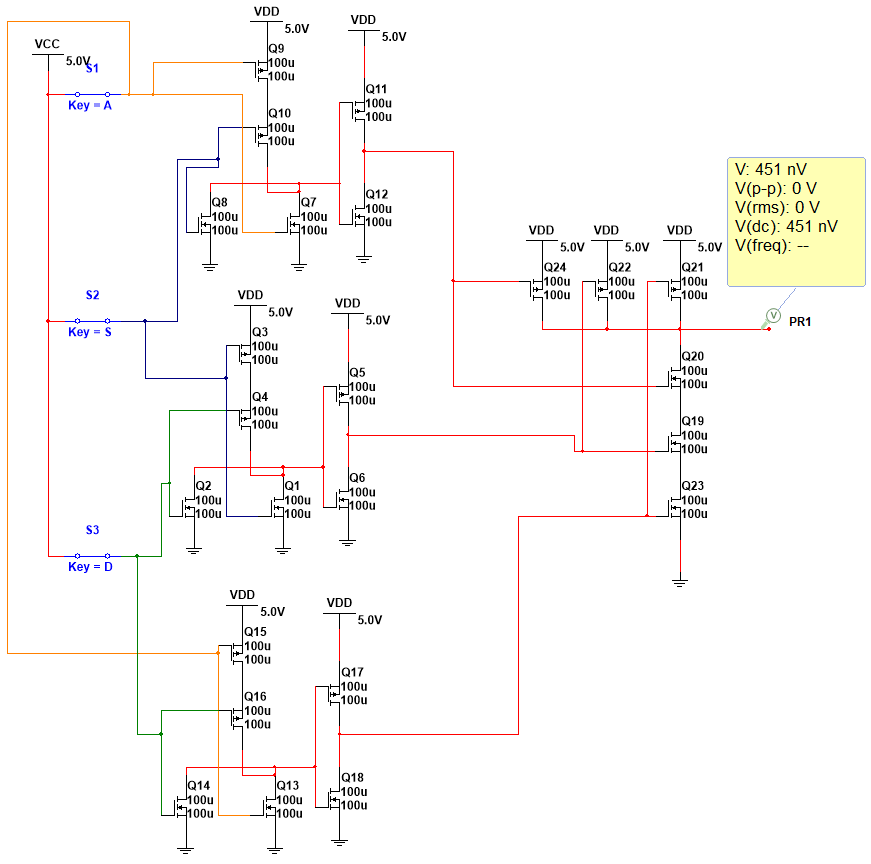
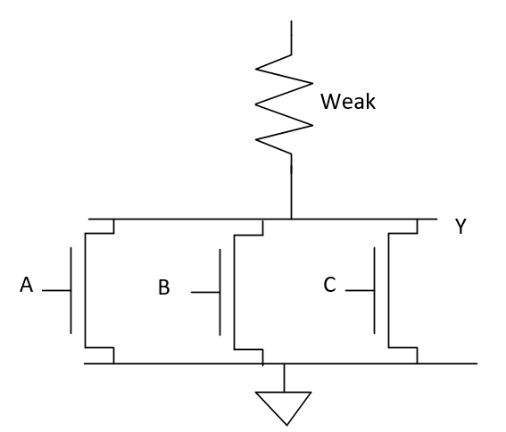

# Ответы на упражения из главы 1

В данной документе приведены ответы на упражнения из первой главы

## Упражнение 1.1

Объясните не менее трех уровней абстракции, которые используются: a)
Биологами, изучающими работу клеток. b) Химиками, изучающими состав
какого-либо материала. Ваше объяснение не должно быть длиннее одного
абзаца.

### Ответ 1.1

a) При изучении клетки биологи используют следующие уровни абстракции:
ткани, культуры, отдельная клетка, Метаболические пути, Биохимические реакции, гены и белки.

b) При изучении состава вещества химики используют следующие
абстракции: смесь, молекула, атом и ионы.

### Ответ 1.2

a) При конструировании автомобилей могут быть использованы следующие
методы

- иерархичность: Автомобиль состоит из больших частей, таких как
  кузов, двигатель, коробка передач, а каждая деталь состоит из более
  мелких частей
- модульность: части автомобиля разделены по функциям, таким как
  двигатель для создания движущей силы, коробки передач для изменения
  передаточной силы и рулевой колонки для поворота колёс
- регулярность: части автомобиля заменяем в одно шасси можно
  устанавливать различные двигатели, сидения и т.д.

b) При управлении бизнесом для управления ежедневными операциями могут
быть использованы следующие методы:

- иерархичность: совещания устраиваются только с непосредственными
  подчиненными
- модульность: каждый отдел работает только над определенной задачей
- регулярность: все отделы используют унифицированный документооборот

### Ответ 1.3

Бен Битдидл строит дом. Чтоб сэкономить время и ресурсы ему стоит
стоит использовать следующие принципы:

- иерархичность: сначала стоить фундамент, затем крышу и стены и лишь
  в конце заниматься отделкой.
- модульность: стоить дом и больших готовых блоков
- регулярность: при строительстве выбирать одинаковые размеры дверных
  проемов и окон и стройматериалов

## Упражнение 1.4

Допустим, что напряжение аналогового сигнала в нашей системе меняется в
пределах от 0 вольт до 5 вольт. Если мы можем измерить это напряжение с
точностью до ±50 милливольт, какое максимальное количество информации в
битах этот сигнал может передавать?

### Ответ 1.4

Если точность ±50 милливольт, то шкала имеет 100 отчётов.
Соответственно, по формуле D=log₂N bits
=log₂100 = 6 в результате получем 6,6 байт.

## Упражнение 1.5

На стене висят старые часы с отломанной минутной стрелкой

a) Если, используя только часовую стрелку, вы можете определить
текущее время с точностью до 15 минут, то сколько битов информации о
времени вы можете получить, глядя на эти часы?

b) Если вы будете знать, какая сейчас половина дня – до или после
полудня, то сколько дополнительных битов информации о текущем времени
вы получите?

### Ответ 1.5

a) 12 часов это по 15 минут это 48 отсчётов. По формуле D=log₂*N*
bits =log₂48 = 4.56 бита информации

b) Если известно какая сейчас половина дня, то по формуле D=log₂*N*
bits =log₂(48\*2) = 5.25 бита информации

## Упражнение 1.6

Примерно 4000 лет назад вавилоняне разработали шестидесятеричную (по
основанию 60) систему счисления. Сколько битов информации передает одна
шестидесятеричная цифра? Как можно записать число 400010, используя
шестидесятеричную систему счисления?

### Ответ 1.6

Одна шестидесятеричная цифра хранит log₂60 = 4.787491742782
бита информации

Число 4000₁₀ можно записать как
1\*60²+6\*60¹+40\*60⁰=1_6\_40₆₀

## Упражнение 1.7

Как много различных чисел может быть представлено 16 битами?

### Ответ 1.7

2¹⁶=65536

## Упражнение 1.8

Какое максимальное значение может быть представлено 32-разрядным
двоичным числом?

### Ответ 1.8

2³²=4 294 967 296

## Упражнение 1.9

Какое максимальное 16-разрядное двоичное число вы можете представить,
используя системы представления двоичных чисел, перечисленные ниже?

1. Двоичное число без знака (unsigned)

2. Дополнительный код (two's complement)

3. Прямой код (sign/magnitude)

### Ответ 1.9

1. Двоичное число без знака (unsigned) – 2¹⁶=65536

2. Дополнительный код (two's complement) – 2¹⁶⁻¹-1 = 32767

3. Прямой код (sign/magnitude) – 2¹⁶⁻¹-1 = 32767

## Упражнение 1.10

Какое максимальное 32-разрядное двоичное число вы можете представить,
используя системы представления двоичных чисел, перечисленные ниже?

1. Двоичное число без знака (unsigned)

2. Дополнительный код (two's complement)

3. Прямой код (sign/magnitude)

### Ответ 1.10

1. Двоичное число без знака (unsigned) – 2³²=4 294 967 296

2. Дополнительный код (two's complement) – 2³²⁻¹-1 = 2 147 483 647

3. Прямой код (sign/magnitude) – 2³²⁻¹-1 = 2 147 483 647

## Упражнение 1.11

Какое минимальное (наименьшее отрицательное) 16-разрядное двоичное число
вы можете представить, используя системы представления двоичных чисел,
перечисленные ниже?

1. Двоичное число без знака (unsigned)

2. Дополнительный код (two's complement)

3. Прямой код (sign/magnitude)

### Ответ 1.11

1. Двоичное число без знака (unsigned) – 0

2. Дополнительный код (two's complement) – -2¹⁶⁻¹= -32 768

3. Прямой код (sign/magnitude) – -2¹⁶⁻¹+1 = -32 767

## Упражнение 1.12

Какое минимальное (наименьшее отрицательное) 32-разрядное двоичное
число вы можете представить, используя системы представления двоичных
чисел, перечисленные ниже?

1. Двоичное число без знака (unsigned)

2. Дополнительный код (two's complement)

3. Прямой код (sign/magnitude)

### Ответ 1.12

1. Двоичное число без знака (unsigned) – 0

2. Дополнительный код (two's complement) – -2³²⁻¹ = -2 147 483 648

3. Прямой код (sign/magnitude) – -2³²⁻¹+1 = 2 147 483 647

## Упражнение 1.13

Преобразуйте следующие двоичные числа без знака в десятичные.

1. 1010₂

2. 110110₂

3. 11110000₂

4. 000100010100111₂

### Ответ 1.13

1. 1010₂ = 2 + 8 = 10

2. 110110₂ = 2+4+16+32 = 54

3. 11110000₂ = 16 + 32 + 64 + 128 = 240

4. 000_1000_1010_0111₂ = 1 + 2 + 4 + 32 + 128 + 2048 = 2215

## Упражнение 1.14

Преобразуйте следующие двоичные числа без знака в десятичные.

1. 1110₂

2. 100100₂

3. 11010111₂

4. 011101010100100₂

### Ответ 1.14

1. 1110₂ = 2+4+8 = 14

2. 10_0100₂ = 4 + 32 = 36

3. 1101_0111₂ = 255 - 8 - 32 = 220

4. 011_1010_1010_0100₂ = 15012

## Упражнение 1.15

Преобразуйте двоичные числа без знака из **упражнения 1.13** в
шестнадцатеричные.

### Ответ 1.15

1. 1010₂ = 0xA

2. 11+0110₂ = 6 + 30 = 0x36

3. 1111_0000₂ = 0 + F0 = 0xF0

4. 000_1000_1010_0111₂ = 7 + A0 + 800 = 0x8A7

## Упражнение 1.16

Преобразуйте двоичные числа без знака из **упражнения 1.14** в
шестнадцатеричные.

### Ответ 1.16

1. 1110₂ = 2+4+8 = 14 = 0xD

2. 10_0100₂ = 0x20 + 0x4 = 0x24

3. 1101_0111₂ = 0xD0+0x7= 0x97

4. 011_1010_1010_0100₂ = 0x4 + 0xA0 + 0xA00+0x3000=0x3AA4

## Упражнение 1.17

Преобразуйте следующие шестнадцатеричные числа в десятичные.

1. A5₁₆

2. 3B₁₆

3. FFFF₁₆

4. D000_0000₁₆

### Ответ 1.17

1. A5₁₆ = 16\*10 + 5 = 165

2. 3B₁₆ = 16\*3 + 11 = 48 + 11 = 59

3. FFFF₁₆ = 16^3\*15 + 16^2\*15 + 16\*15 + 15 = 61 440 + 3 840 + 240 +
15 = 65 535

4. D000 0000₁₆ = 16^7\*13 = 3 489 660 928

## Упражнение 1.18

Преобразуйте следующие шестнадцатеричные числа в десятичные.

1. 4E₁₆

2. 7C₁₆

3. ED3A₁₆

4. 403FB001₁₆

### Ответ 1.18

1. 4E₁₆ = 64 + 14 = 78

2. 7C₁₆ = 16\*7 + 12 = 122 + 12 = 134

3. ED3A₁₆ = 10 + 3\*16 + 13\*16^2 + 14\*16^3 = 10 + 48 + 3 328 + 57
344 = 60 730

4. 403F_B001₁₆ = 1_077_915_649

## Упражнение 1.19

Преобразуйте шестнадцатеричные числа из **упражнения 1.17** в двоичные
числа без знака.

### Ответ 1.19

1. A5₁₆ = 1010 0101₂

2. 3B₁₆ = 11 1011₂

3. FFFF₁₆ = 1111 1111 1111 1111₂

4. D000 0000₁₆ = 1101 0000 0000 0000 0000 0000 0000 0000₂

## Упражнение 1.20

Преобразуйте шестнадцатеричные числа из **упражнения 1.18** в двоичные
числа без знака.

### Ответ 1.20

1. 4E₁₆ = 0100 1110₂

2. 7C₁₆ = 0111 1100 ₂

3. ED3A₁₆ = 1110 1101 0011 1010₂

4. 403F_B001₁₆ = 0100 0000 0011 1111 1011 0000 0000 0001₂

## Упражнение 1.21

Преобразуйте следующие двоичные числа, представленные в дополнительном
коде, в десятичные.

1. 1010₂
2. 110110₂
3. 01110000₂
4. 10011111₂

### Ответ 1.21

1. 1010₂ = -(0101₂ + 1₂) = -(0110₂) = -6

2. 110110₂ = -(001001₂ + 1₂) =-(001010₂) = -10

3. 01110000₂ = 7\*16 = 112

4. 10011111₂ = -(01100000₂+1₂)=-(01100001₂) = -(6\*16 + 1) = -97

## Упражнение 1.22

Преобразуйте следующие двоичные числа, представленные в дополнительном
коде, в десятичные.

1. 1110₂

2. 100011₂

3. 01001110₂

4. 10110101₂

### Ответ 1.22

1. 1110₂= -(0001 + 1) = -(0010) = -2

2. 100011₂ = -(011100 + 10) = -(011101) = -(16 + 13) = -29

3. 01001110₂ = 4\*16 + 14 = 64 + 14 = 78

4. 10110101₂ = - (01001010+1) = -(01001011) = -(4\*16 + 10) = -
(64 + 11) = -75

## Упражнение 1.23

Преобразуйте двоичные числа из **упражнения 1.21** в десятичные, считая,
что эти двоичные числа представлены не в дополнительном, а в прямой
коде.

### Ответ 1.23

1. 1010₂ = -(010) = -2

2. 110110₂ = -(10110) =-(16 + 6) = -22

3. 01110000₂ = 7\*16 = 112

4. 10011111₂ = -(001 1111₂)= -(01100001₂) = -(16 + 15) = -31

## Упражнение 1.24

Преобразуйте двоичные числа из **упражнения 1.22** в десятичные, считая,
что эти двоичные числа представлены не в дополнительном, а в прямой
коде.

### Ответ 1.24

1. 1110₂= -(110) = -6

2. 100011₂ = -(00011) = -3

3. 01001110₂ = 4\*16 + 14 = 64 + 14 = 78

4. 10110101₂ = - (0110101) = -(3\*16 + 4) = -(42 + 4) = -46

## Упражнение 1.25

Преобразуйте следующие десятичные числа в двоичные числа без знака.

1. 42₁₀

2. 63₁₀

3. 229₁₀

4. 845₁₀

### Ответ 1.25

1. 42₁₀ = 32 + 8 + 2 = 0b101010

2. 63₁₀ = 32 + 16 + 8 + 4 + 2 + 1 = 0b111111

3. 229₁₀ = 128 + 64 + 32 + 4 + 1 = 0b11100101

4. 845₁₀ = 512 + 256 + 64 + 8 + 4 + 1 = 0b11_0100_1101

## Упражнение 1.26

Преобразуйте следующие десятичные числа в двоичные числа без знака.

1. 14₁₀

2. 52₁₀

3. 339₁₀

4. 711₁₀

### Ответ 1.26

1. 14₁₀ = 8 + 4 + 2 = 0b1110

2. 52₁₀ = 32 + 16 + 4 = 0b110100

3. 339₁₀ = 256 + 64 + 16 + 2 + 1 = 0b101010011

4. 711₁₀ = 512 + 128 + 64 + 4 + 2 + 1 = 0b1011000111

## Упражнение 1.27

Преобразуйте десятичные числа из **упражнения 1.25** в
шестнадцатеричные.

### Ответ 1.27

1. 42₁₀ = 0b10_1010 = 0x2A

2. 63₁₀ = 0b11_1111 =0x3F

3. 229₁₀ = 0b1110_0101 = 0xE5

4. 845₁₀ = 0b11_0100_1101 = 0x34D

## Упражнение 1.28

Преобразуйте десятичные числа из **упражнения 1.26** в
шестнадцатеричные.

### Ответ 1.28

1. 14₁₀ = 0b1110 = 0xE

2. 52₁₀ = 0b11_0100 = 0x34

3. 339₁₀ = 0b1_0101_0011 = 0x153

4. 711₁₀ = 0b10_1100_0111 = 0x2C7

## Упражнение 1.29

Преобразуйте следующие десятичные числа в 8-битные двоичные числа,
представленные в дополнительном коде. Укажите, имеет ли место
переполнение.

1. 42₁₀

2. −63₁₀

3. 124₁₀

4. −128₁₀

5. 133₁₀

### Ответ 1.29

1. 42₁₀ = 32 + 8 + 2 = 8’0b0010_1010

2. −63₁₀ = -(63) = -(32+16+8+4+2+1) = -(0b00111111) = 0b1100_0001

3. 124₁₀ = 64 + 32 + 16 + 8 + 4 = 0b0111_1100

4. −128₁₀ = 0b1000_0000

5. 133₁₀ = переполнение

## Упражнение 1.30

Преобразуйте следующие десятичные числа в 8-битные двоичные числа,
представленные в дополнительном коде. Укажите, имеет ли место
переполнение.

1. 24₁₀

2. −59₁₀

3. 128₁₀

4. −150₁₀

5. 127₁₀

### Ответ 1.30

1. 24₁₀ = 16 + 8 = 0b0001_1000
2. −59₁₀ = - (59) = -(32 + 16 + 8 + 2 + 1) = -(0b0011_1011)
    = 0b1100_0101
3. 128₁₀ = переполнение
4. −150₁₀ = переполнение
5. 127₁₀ = 0b01111111

## Упражнение 1.31

Преобразуйте десятичные числа из **упражнения 1.29** в 8-битные двоичные
числа, представленные в прямом коде.

1. 42₁₀ = 32 + 8 + 2 = 8’0b0010_1010
2. −63₁₀ = -(63) = -(32+16+8+4+2+1) = -(0b00111111) =
    0b10111111
3. 124₁₀ = 64 + 32 + 16 + 8 + 4 = 0b0111_110
4. −128₁₀ = переполнение
5. 133₁₀ = переполнение

## Упражнение 1.32

Преобразуйте десятичные числа из **упражнения 1.30** в 8-битные двоичные
числа, представленные в прямом коде.

### Ответ 1.32

1. 24₁₀ = 16 + 8 = 0b0001_1000
2. −59₁₀ = - (59) = -(32 + 16 + 8 + 2 + 1) = -(0b0011_1011)
    = 0b1011_1011
3. 128₁₀ = переполнение
4. −150₁₀ = переполнение
5. 127₁₀ = 0b01111111

## Упражнение 1.33

Преобразуйте следующие 4-разрядные двоичные числа, представленные в
дополнительном коде, в 8-разрядные двоичные числа, представленные в
дополнительном коде:

a)  0101₂

b)  1010₂

### Ответ 1.33

a)  0101₂ = 0000_0101 ₂

b)  1010₂ = 1111_1010 ₂

## Упражнение 1.34

Преобразуйте следующие 4-разрядные двоичные числа,
представленные в дополнительном коде, в 8-разрядные двоичные числа,
представленные в дополнительном коде:

a) 0111₂

b) 1001₂

### Ответ 1.34

a) 0111₂ = 0000_0111₂

b) 1001₂ = 1111_1001₂

## Упражнение 1.35

Преобразуйте 4-разрядные двоичные числа из
**упражнения 1.33** в 8-разрядные, считая, что это двоичные числа без знака.

### Ответ 1.35

a)  0101₂ = 0000_0101₂

b)  1010₂ = 0000_1010₂

## Упражнение 1.36

Преобразуйте 4-разрядные двоичные числа из **упражнения 1.34** в
8-разрядные, считая, что это двоичные числа без знака.

### Ответ 1.36

a) 0111₂ = 0000_0111₂

b) 1001₂ = 0000_1001₂

## Упражнение 1.37

Система счисления по основанию 8 называется восьмеричной
(octal). Представьте каждое из чисел в **упражнении 1.25** в
восьмеричном виде.

### Ответ 1.37

a)  42₁₀ = 52 ₈

b)  63₁₀ = 7\*8+ 7 = 77₈

c)  229₁₀ = 3\*8^2 + 4\*8 + 5 = 345₈

d)  845₁₀ = 1\*8^3 + 5\*8^2 + 1\*8 + 5 = 1515₈

## Упражнение 1.38

Система счисления по основанию 8 называется восьмеричной
(octal). Представьте каждое из чисел в **упражнении 1.26** в восьмеричном виде.

### Ответ 1.38

1. 14₁₀ = 1\*8 + 6 = 16₈
2. 52₁₀ = 64₈
3. 339₁₀ = 5\*8^2 + 2\*8 + 3 = 523₈
4. 711₁₀ = 1\*8^3 + 3\*8^2 + 7 = 1307₈

## Упражнение 1.39

 Преобразуйте каждое из следующих восьмеричных чисел в двоичное,
 шестнадцатеричное и десятичное:

a) 42₈

b) 63₈

c) 255₈

d) 3047₈

### Ответ 1.39

a) 42₈ = 100010₂ = 22 ₁₆ = 34₁₀

b) 63₈ = 110011₂ = 33 ₁₆ = 51 ₁₀

c) 255₈ = 1010_1101₂ = AD ₁₆ = 173₁₀

d) 3047₈ = 110_0010_0111₂ = 627₁₆ = 1575₁₀

## Упражнение 1.40

Преобразуйте каждое из следующих восьмеричных чисел в
двоичное, шестнадцатеричное и десятичное:

a) 23₈

b) 45₈

c) 371₈

d) 2560₈

### Ответ 1.40

a) 23₈ = 010_011₂ = 13₁₆  = 19₁₀

b) 45₈ = 100_101₂ = 25₁₆=37₁₀

c) 371₈ = 011_111_001₂ =F9₁₆=249₁₀

d) 2560₈ = 0101_0111_0000₂ =570₁₆= 1392₁₀

## Упражнение 1.41

Сколько 5-разрядных двоичных чисел, представленных в дополнительном
коде, имеют значение большее, чем 0? Сколько – меньшее, чем 0? Каким
будет правильный ответ в случае 5-разрядных двоичных чисел,
представленных в прямом коде?

### Ответ 1.41

5-разрядных двоичных чисел, представленных в дополнительном коде,
имеющий значение большее, чем 0 будет 2^(5-1)-1 = 15. Меньше чем 0
будет 16. в прямом коде положительных и отрицательных будет по 15.

## Упражнение 1.42

Сколько 7-разрядных двоичных чисел, представленных в дополнительном
коде, имеют значение большее, чем 0? Сколько меньшее, чем 0? Каким
будет правильный ответ в случае 7-разрядных двоичных чисел,
представленных в прямом коде?

### Ответ 1.42

7-разрядных двоичных чисел, представленных в дополнительном коде,
имеющий значение большее, чем 0 будет 2^(7-1)-1 = 63. Меньше чем 0
будет 64. в прямом коде положительных и отрицательных будет по 63.

## Упражнение 1.43

Сколько байтов в 32-битном слове? Сколько полубайтов?

### Ответ 1.43

В 32-битном слове 4 байта или 8 полубайтов.

## Упражнение 1.44

Сколько байтов в 64-битном слове?

### Ответ 1.44

В 64-битном слове 8 байт.

## Упражнение 1.45

Если DSL-модем работает со скоростью 768 кбит/сек, сколько байт он
может передать за 1 минуту?

### Ответ 1.45

1. 768\*60 = 46 080 кбит/мин

2. 46 080 \* 1024 = 47 185 920 бит/мин

3. 47 185 920 \* 8 = 5 898 240 байт/мин

**Ответ**: 5 898 240 байт/мин

## Упражнение 1.46

USB3.0 передает данные со скоростью 5 Гбит/сек. Сколько байт USB3.0
может передать за 1 минуту?

### Ответ 1.46

1. 5\*1024\*1024\*1024= 5 368 709 120 бит/с

2. 5 368 709 120 \* 60 = 322 122 547 200 бит/с

3. 322 122 547 200 / 8 = 40 265 318 400 байт/с

**Ответ**: 40 265 318 400 байт/с

## Упражнение 1.47

Производители жестких дисков измеряют объемы данных в мегабайтах, что
означает 10⁶ байт, и гигабайтах, что означает 10⁹ байт. Сколько
гигабайтов музыки вы можете сохранить на 50-гигабайтном жестком
диске?

### Ответ 1.47

50\*1000^3 / 1024^3 = 46,5 гигабайт музыки

**Ответ**: 46,5 гигабайт музыки

## Упражнение 1.48

Без использования калькулятора рассчитайте
приблизительное значение 2³¹.

### Ответ 1.48

2¹⁰ = 1024, а значит 2³¹ приблизительно равно 2 000 000 000

**Ответ**: приблизительно= 2 000 000 000

## Упражнение 1.49

Память процессора Pentium II организована как прямоугольный массив
битов, состоящий из 28 строк и 29 колонок. Без использования
калькулятора рассчитайте приблизительное количество битов в этом
массиве.

### Ответ 1.49

28\*29 = приблизительно 900

**Ответ**: приблизительно 900

## Упражнение 1.50

Нарисуйте цифровую шкалу, аналогичную изображенной на **Рис. 1.11**
для 3-битного двоичного числа, представленного в дополнительном коде
и прямом коде.

### Ответ 1.50


## Упражнение 1.51

Нарисуйте цифровую шкалу, аналогичную изображенной на **Рис. 1.11**
для 2-битного двоичного числа, представленного в дополнительном коде
и прямом коде.

### Ответ 1.51


## Упражнение 1.52

Сложите следующие двоичные числа без знака:

a) 1001₂ + 0100₂

b) 1101₂ + 1011₂

Укажите, если сумма переполняет 4-битный регистр.

### Ответ 1.52

a) 1001₂ + 0100₂ = 1101₂ = 13₁₀

b) 1101₂ + 1011₂ = 10000₂ 16₁₀ -- c переполнением

## Упражнение 1.53

Сложите следующие двоичные числа без знака:

a) 10011001₂ + 01000100₂

b) 11010010₂ + 10110110₂

Укажите, если сумма переполняет 8-битный регистр.

### Ответ 1.53

a) 10011001₂ + 01000100₂ = 11011101₂ = 13\*16+13 = 209₁₀

b) 11010010₂ + 10110110₂ = 100001000₂ =  264 209₁₀ -- c переполнением

## Упражнение 1.54

Выполните **упражнение 1.52**, считая, что двоичные числа в этом
упражнении представлены в дополнительном коде.

### Ответ 1.54

a) 1001₂ + 0100₂ = 1101₂ = -(011)₂ = -3 ₁₀

b) 1101₂ + 1011₂ = 10000 ₂ = -16₁₀ -- c переполнением

## Упражнение 1.55

Выполните **упражнение 1.53**, считая, что двоичные числа в этом
упражнении представлены в дополнительном коде.

### Ответ 1.55

a) 10011001₂ + 01000100₂ = 11011101 ₂ = -(0100011)₂ = -35₁₀

b) 11010010₂ + 10110110₂ = 10001000 ₂ = -(1111000)₂ = -120₁₀

## Упражнение 1.56

Преобразуйте следующие десятичные числа в 6-битные двоичные числа,
представленные в дополнительном коде, и сложите их:

 a)  16₁₀ + 9₁₀

 b)  27₁₀ + 31₁₀

 c)  −4₁₀ + 19₁₀

 d)  3₁₀ + −32₁₀

 e)  −16₁₀ + −9₁₀

 f)  −27₁₀ + −31₁₀

Укажите, если сумма переполняет 6-битный регистр.

### Ответ 1.56

 a)  16₁₀ + 9₁₀ = 010000 + 001001 = 011001₂

 b)  27₁₀ + 31₁₀ = 011011 + 011111 = 111010 ₂ с переполнением

 c)  −4₁₀ + 19₁₀ = -(000100) + (010011) = 111100 + 010011 = 001111₂ =
 15₁₀

 d)  3₁₀ + −32₁₀ = 000011 + 100000 = 100011 ₂ = -29 ₁₀

 e)  −16₁₀ + −9₁₀ = 110000 + 110111 = 100111

 f)  −27₁₀ + −31₁₀ -- переполнение

## Упражнение 1.57

Преобразуйте следующие десятичные числа в 6-битные двоичные числа,
представленные в дополнительном коде, и сложите их:

a) 7₁₀+ 13₁₀

b) 17₁₀ + 25₁₀

c) −26₁₀ + 8₁₀

d) 31₁₀ + −14₁₀

e) −19₁₀+ −22₁₀

f) −2₁₀ + −29₁₀

Укажите, если сумма переполняет 6-битный регистр.

### Ответ 1.57

a) 7₁₀+ 13₁₀ = 000111₂ + 001101₂ = 010100₂

b) 17₁₀ + 25₁₀ = 010001₂ + 011001₂ = 101010₂ -- переполнение

c) −26₁₀ + 8₁₀ = 100110₂ + 001000₂ = 101110₂ = -18₁₀

d) 31₁₀ + −14₁₀ = 0111111₂ + 110010₂ = 010001₂ = 17₁₀

e) −19₁₀+ −22₁₀ = 101101₂ + 001010₂ = 110111₂

f) −2₁₀ + −29₁₀ = 111110₂ + 100011₂ = 100001₂

## Упражнение 1.58

Сложите следующие шестнадцатеричные числа без знака:

a) 7₁₆ + 9₁₆

b) 13₁₆ + 28₁₆

c) AB₁₆ + 3E₁₆

d) 8F₁₆ + AD₁₆

Укажите, если сумма переполняет 8-битный регистр (два шестнадцатеричных
числа).

### Ответ 1.58

При сложении цифры суммируются по разрядам, и если при этом возникает
избыток, то он переносится влево.

a) 7₁₆ + 9₁₆ = 10₁₆

b) 13₁₆ + 28₁₆ = 3B₁₆

c) AB₁₆ + 3E₁₆ = E9₁₆

d) 8F₁₆ + AD₁₆ = 13C₁₆ -- с переполнением 8-битного регистра

## Упражнение 1.59

Сложите следующие шестнадцатеричные числа без знака:

a) 22₁₆ + 8₁₆

b) 73₁₆ + 2C₁₆

c) 7F₁₆ + 7F₁₆

d) C2₁₆+ A4₁₆

Укажите если сумма переполняет 8-битный регистр (два шестнадцатеричных
числа).

### Ответ 1.59

a) 22₁₆ + 8₁₆ = 2A₁₆

b) 73₁₆ + 2C₁₆ = 9F₁₆

c) 7F₁₆ + 7F₁₆ = FE₁₆

d) C2₁₆+ A4₁₆ = 166₁₆ -- с переполнением 8-битного регистра

## Упражнение 1.60

Преобразуйте следующие десятичные числа в 5-разрядные двоичные числа,
представленные в дополнительном коде, и вычтите одно число из
другого:

a) 9₁₀ − 7₁₀

b) 12₁₀ − 15₁₀

c) −6₁₀ − 11₁₀

d) 4₁₀ − −8₁₀

Укажите, если разность переполняет 5-битный регистр.

### Ответ 1.60

a) 9₁₀ − 7₁₀ = 01001₂  + (-(00111)₂)= 01001₂ + 11001 ₂ = 00010₂

b) 12₁₀ − 15₁₀ = 01100₂ + 10001₂ = 11101₂

c) −6₁₀ − 11₁₀ = 11010₂ + 10101₂ = 01111₂ -- с переполнением 5-битного
регистра

d) 4₁₀ − −8₁₀ = 00100₂ + 01000₂ = 01100₂

## Упражнение 1.61

Преобразуйте следующие десятичные числа в 6-разрядные двоичные числа,
представленные в дополнительном коде, и вычтите одно число из
другого:

a) 18₁₀ − 12₁₀

b) 30₁₀ − 9₁₀

c) −28₁₀ − 3₁₀

d) −16₁₀ − 21₁₀

Укажите, если разность переполняет 6-битный регистр.

### Ответ 1.61

a) 18₁₀ − 12₁₀ = 010010₂ + 110100₂ = 000110₂

b) 30₁₀ − 9₁₀ = 011110₂ + 110111₂ = 010101₂

c) −28₁₀ − 3₁₀ = 100100₂ + 111101₂= 110001₂

d) −16₁₀ − 21₁₀ = 110000₂  + 101011₂ = 011011₂  -- с переполнением 6-битного регистра

## Упражнение 1.62

В N-битной двоичной системе счисления со смещением B (N-bit binary
number system with bias B) положительные и отрицательные числа
представляются как значения этих чисел в обычной двоичной системе
плюс смещение B. Например, для 5-битной двоичной системы счисления со
смещением 15 число 0 представляется как 01111, а число 1
представляется как 10000 и так далее. Системы счисления со смещением
иногда используется для выполнения математических операций с
плавающей запятой, которые будут рассмотрены в главе 0. Ответьте на
следующие вопросы применительно к 8-битной системе счисления со
смещением 127₁₀:

a) Какое десятичное значение соответствует двоичному числу 10000010₂?

b) Какое двоичное число соответствует значению 0?

c) Как в такой системе будет выглядеть минимальное отрицательное
двоичное число, и каким будет его десятичный эквивалент?

d) Как в такой системе будет выглядеть максимальное положительное
двоичное число, и каким будет его десятичный эквивалент?

### Ответ 1.62

a) 10000010₂ - 127₁₀ = 130₁₀-127₁₀ = 2₁₀

b) 0 + 127₁₀ = 0111_1111₂

c) минимальное двоичное число 0000_0000₂, а его десятичный эквивалент -127₁₀

d) максимальное двоичное число 1111_1111₂, а его десятичный эквивалент 128

## Упражнение 1.63

Нарисуйте цифровую шкалу, аналогичную изображенной на **Рис. 1.11**
для 3-битного двоичного числа со смещением равным 3. Что такое
система счисления со смещением, объясняется в **упражнении 1.62**.

### Ответ 1.63


## Упражнение 1.64

В двоично-кодированной десятичной системе счисления
(binary-coded decimal system или BCD) 4 бита используются для представления
десятичных чисел от 0 до 9. Например, 37₁₀ записывается как 00110111(BCD).

Ответьте на следующие вопросы применительно к двоично-кодированной
десятичной системе счисления:

a) Как будет выглядеть 289₁₀ в двоично-кодированной десятичной системе счисления?

b) Как выглядит десятичный эквивалент 100101010001(BCD)?

c) Как выглядит двоичный эквивалент 01101001(BCD)?

d) Какие, по-вашему мнению, преимущества имеет двоично-кодированная
десятичная система счисления?

### Ответ 1.64

a) 289₁₀ = 0010_1000_1001(BCD)>

b) 1001_0101_0001(BCD) = 951₁₀

c) 0110_1001(BCD) = 69₁₀ = ‭0100_0101‬₂

d) При двоично-кодированной системе счисления можно производить
преобразования чисел простой заменой?

## Упражнение 1.65

Ответьте на следующие вопросы применительно к двоично- кодированной
десятичной системе счисления:

a) Как будет выглядеть 371₁₀ в двоично-кодированной десятичной системе
счисления?

b) Как выглядит десятичный эквивалент 000110000111(BCD)?

c) Как выглядит двоичный эквивалент 10010101(BCD)?

d) Какие, на ваш взгляд, недостатки имеет двоично-кодированная
десятичная система счисления по сравнению с двоичной?

Что такое двоично-кодированная десятичная система счисления со
смещением, объясняется в **упражнении 1.64**.

### Ответ 1.65

a) 371₁₀ = 0011_0111_0001(BCD)

b) 0001_1000_0111(BCD) = 187(BCD)

c) 1001_0101(BCD) = 95₁₀ = 1010₂

d) При двоично-кодированной системе счисления избыточность 60%

## Упражнение 1.66

Марсианская летающая тарелка потерпела крушение на кукурузном поле в
штате Небраска. Следователи ФБР обнаружили среди обломков руководство
по космической навигации с формулами, записанными в марсианской
системе счисления. Одна из формул выглядит следующим образом: 325 +
42 = 411. Если эта формула записана без ошибок, сколько пальцев на
руке марсианина вы бы ожидали увидеть?

### Ответ 1.66

Максимальное число 5, а значит в системе счисления марсиан есть как
минимум цифры от 0 до 5, что соответствует шестеричной системе
счисления. Проверим гипотезу и сложим 325₆ + 42₆ = 411₆.

Ответ: у марсиан шестеричная система счисления.

## Упражнение 1.67

У Бена Битдидла и Алисы П. Хакер возник спор (прим. переводчика: в
англоязычном варианте имя Alyssa P. Hacker созвучно выражению "a LISP
hacker", т.е. LISP-хакер (LISP – семейство функциональных языков
программирования). Бен утверждает, что у всех целых чисел, которые
больше нуля и кратны шести, есть точно две единицы в двоичном
представлении. Алиса не согласна. По ее мнению, все такие числа имеют
четное количество единиц в их представлении. Вы согласны с Беном, с
Алисой, с обоими или ни с кем из них? Объясните.

### Ответ 1.67

6 это 0110, а 2 это сдвиг вправо и по этому при умножении 6 на 2 любое
количество раз эти 11 просто будут сдвигаться. 6 состоит из 2 и 3.
Если любое число умножить на два, то самый правый разряд будет 0.
Если любое число сложить с самим собой три раза, то появится
комбинация 11. Следовательно уже все чисел кратным 3 уже будут точно
две единицы и по это Бен Прав. Алиса не права, так как уже число 42
(101010) имеет нечетное количество единиц и кратно шести.

**Ответ**:
Бен прав, а Алиса не права.

## Упражнение 1.68

Бен Битдидл и Алиса П. Хакер еще раз спорят. Бен говорит: “я могу
получить двоичное дополнение числа путем вычитания 1, а затем
инвертируя все биты результата.” Алиса отвечает: “Нет, я могу это
сделать путем проверки каждого бита, начиная с наименее значимых.
Когда встречу первую 1, инвертирую каждый последующий бит.” Вы
согласны с Беном, или с Алисой, или с обоими, или ни с кем?
Объясните.

### Ответ 1.68

Проверим гипотезу Бена на числе -5:

По методу Бена:

-5 = -(0101) = 1010-1 = 1001

Обычным способом:

-5 = -(0101) = 1010+1 = 1011

Ответ отличается, а следовательно Бен не прав

проверим гипотезу Алисы на числе 5

-5 =-(0101) = 1011

Ответ: Бен не прав, а Алиса права.

## Упражнение 1.69

Напишите программу на вашем любимом языке (например, C,
Java, Perl) для преобразования двоичных чисел в десятичные. Пользователь
должен ввести без-знаковое двоичное число. Программа должна распечатать
его десятичный эквивалент.

### Ответ 1.69

```C++
#include <iostream>
#include <string>
#include <math.h>

int main()
{
    //считать строку
    // для длинны строки считать каждый символ и умножить его на степень порядка
    std::string input;
    std::cout << "Input bin (ex. 100110):\n";
    std::cin >> input;
    int sum = 0;
    for (int i = input.length(); i > 0; i--)
    {

        sum += (input[i - 1] - '0')*(pow(2, i));
    }
    std::cout << sum << std::endl;
}

```

## Упражнение 1.70

Повторите упражнение 1.69, но для преобразования чисел в
системе счисления с произвольной базой b1 в числа в системе счисления
с другой базой b2. Поддержите все базы до 16, для цифр больше 9 используйте
буквы алфавита. Пользователь должен ввести b1, b2, а затем число в системе
счисления с базой b1. Программа должна напечатать эквивалентное число в
системе счисления с базой b2.

### Ответ 1.70

```C++

#include <iostream>
#include <string>
#include <math.h>


int val(char a)
{
    if (a <= '0' && a >= '1')
        return a - '0';

    switch (a)
    {
    case 'a':
        return 10;
    case 'b':
        return 11;
    case 'c':
        return 12;
    case 'd':
        return 13;
    case 'e':
        return 14;
    case 'f':
        return 15;
    }
}

int main()
{
    //считать строку
    // для длинны строки считать каждый символ и умножить его на степень порядка
    std::string input;
    std::string output;
    int base1, base2;

    std::cout << "Input base1, base2, input (ex. 100110):\n";
    std::cin >> base1 >> base2 >> input;
    int sum = 0;


    std::cout
        << "Base1: " << base1 << std::endl
        << "Base2: " << base2 << std::endl
        << "Input: " << input << std::endl;

    //any to dec
    for (int i = input.length(); i > 0; i--)
    {
        sum += (val(input[i - 1]))*(pow(base1, input.length() - i));
    }

    //dec to any
    while (sum > 0)
    {
        int tmp;
        tmp = sum % base2;

        output+= std::to_string(tmp);
        sum /= base2;
    }

    std::string reverse_output;

    for (int n = output.length() - 1; n >= 0; n--) {
        reverse_output.push_back(output[n]);
    }


    std::cout << "Out2: " << reverse_output << std::endl;
}

```

## Упражнение 1.71

Нарисуйте обозначение, логическое уравнение и таблицу
истинности для:

a) Вентиля ИЛИ с тремя входами

b) Вентиля исключающее ИЛИ с тремя входами

c) Вентиля исключающее ИЛИ-НЕ с четырьмя входами

### Ответ 1.71

a) Вентиля ИЛИ с тремя входами

")

Логическое уравнение Y = A + B + C

| A | B | C | Y |
|---|---|---|---|
| 0 | 0 | 0 | 0 |
| 0 | 0 | 1 | 1 |
| 0 | 1 | 0 | 1 |
| 0 | 1 | 1 | 1 |
| 1 | 0 | 0 | 1 |
| 1 | 0 | 1 | 1 |
| 1 | 1 | 0 | 1 |
| 1 | 1 | 1 | 1 |

b) Вентиля исключающее ИЛИ с тремя входами

")

Логическое уравнение Y = A ^ B ^ C

| A | B | C | Y |
|---|---|---|---|
| 0 | 0 | 0 | 0 |
| 0 | 0 | 1 | 1 |
| 0 | 1 | 0 | 1 |
| 0 | 1 | 1 | 0 |
| 1 | 0 | 0 | 1 |
| 1 | 0 | 1 | 0 |
| 1 | 1 | 0 | 0 |
| 1 | 1 | 1 | 1 |

c) Вентиля исключающее ИЛИ-НЕ с четырьмя входами

")

Логическое уравнение Y = ~ (A ^ B ^ C ^ D)

| A | B | C | D | Y |
|---|---|---|---|---|
| 0 | 0 | 0 | 0 | 1 |
| 0 | 0 | 0 | 1 | 0 |
| 0 | 0 | 1 | 0 | 0 |
| 0 | 0 | 1 | 1 | 1 |
| 0 | 1 | 0 | 0 | 0 |
| 0 | 1 | 0 | 1 | 1 |
| 0 | 1 | 1 | 0 | 1 |
| 0 | 1 | 1 | 1 | 0 |
| 1 | 0 | 0 | 0 | 0 |
| 1 | 0 | 0 | 1 | 1 |
| 1 | 0 | 1 | 0 | 1 |
| 1 | 0 | 1 | 1 | 0 |
| 1 | 1 | 0 | 0 | 1 |
| 1 | 1 | 0 | 1 | 0 |
| 1 | 1 | 1 | 0 | 0 |
| 1 | 1 | 1 | 1 | 1 |

## Упражнение 1.72

Нарисуйте обозначение, логическое уравнение и таблицу истинности для:

a) Вентиля ИЛИ с четырьмя входами

b) Вентиля исключающее ИЛИ-НЕ с тремя входами

c) Вентиля И-НЕ с пятью входами

### Ответ 1.72

a) Вентиля ИЛИ с четырьмя входами

")

Логическое уравнение  Y = A + B + C + D

| A | B | C | D | Y |
|---|---|---|---|---|
| 0 | 0 | 0 | 0 | 0 |
| 0 | 0 | 0 | 1 | 1 |
| 0 | 0 | 1 | 0 | 1 |
| 0 | 0 | 1 | 1 | 1 |
| 0 | 1 | 0 | 0 | 1 |
| 0 | 1 | 0 | 1 | 1 |
| 0 | 1 | 1 | 0 | 1 |
| 0 | 1 | 1 | 1 | 1 |
| 1 | 0 | 0 | 0 | 1 |
| 1 | 0 | 0 | 1 | 1 |
| 1 | 0 | 1 | 0 | 1 |
| 1 | 0 | 1 | 1 | 1 |
| 1 | 1 | 0 | 0 | 1 |
| 1 | 1 | 0 | 1 | 1 |
| 1 | 1 | 1 | 0 | 1 |
| 1 | 1 | 1 | 1 | 1 |

b) Вентиля исключающее ИЛИ-НЕ с тремя входами

")

Логическое уравнение Y = ~ (A ^ B ^ C)

| A | B | C | Y |
|---|---|---|---|
| 0 | 0 | 0 | 1 |
| 0 | 0 | 1 | 0 |
| 0 | 1 | 0 | 0 |
| 0 | 1 | 1 | 1 |
| 1 | 0 | 0 | 0 |
| 1 | 0 | 1 | 1 |
| 1 | 1 | 0 | 1 |
| 1 | 1 | 1 | 0 |

c) Вентиля И-НЕ с пятью входами

")

Логическое уравнение Y = A & B & C & D & E

| A | B | C | D | E | Y |
|---|---|---|---|---|---|
| 0 | 0 | 0 | 0 | 0 | 0 |
| 0 | 0 | 0 | 0 | 1 | 0 |
| 0 | 0 | 0 | 1 | 0 | 0 |
| 0 | 0 | 0 | 1 | 1 | 0 |
| 0 | 0 | 1 | 0 | 0 | 0 |
| 0 | 0 | 1 | 0 | 1 | 0 |
| 0 | 0 | 1 | 1 | 0 | 0 |
| 0 | 0 | 1 | 1 | 1 | 0 |
| 0 | 1 | 0 | 0 | 0 | 0 |
| 0 | 1 | 0 | 0 | 1 | 0 |
| 0 | 1 | 0 | 1 | 0 | 0 |
| 0 | 1 | 0 | 1 | 1 | 0 |
| 0 | 1 | 1 | 0 | 0 | 0 |
| 0 | 1 | 1 | 0 | 1 | 0 |
| 0 | 1 | 1 | 1 | 0 | 0 |
| 0 | 1 | 1 | 1 | 1 | 0 |
| 1 | 0 | 0 | 0 | 0 | 0 |
| 1 | 0 | 0 | 0 | 1 | 0 |
| 1 | 0 | 0 | 1 | 0 | 0 |
| 1 | 0 | 0 | 1 | 1 | 0 |
| 1 | 0 | 1 | 0 | 0 | 0 |
| 1 | 0 | 1 | 0 | 1 | 0 |
| 1 | 0 | 1 | 1 | 0 | 0 |
| 1 | 0 | 1 | 1 | 1 | 0 |
| 1 | 1 | 0 | 0 | 0 | 0 |
| 1 | 1 | 0 | 0 | 1 | 0 |
| 1 | 1 | 0 | 1 | 0 | 0 |
| 1 | 1 | 0 | 1 | 1 | 0 |
| 1 | 1 | 1 | 0 | 0 | 0 |
| 1 | 1 | 1 | 0 | 1 | 0 |
| 1 | 1 | 1 | 1 | 0 | 0 |
| 1 | 1 | 1 | 1 | 1 | 1 |

## Упражнение 1.73

Мажоритарный вентиль выдает значение ИСТИНА тогда и только тогда,
когда более половины его входов имеют значение ИСТИНА. Заполните
таблицу истинности для мажоритарного вентиля, показанного на __Рис.
1.41__.

```txt
    ┌──────┐
 A──┤      │
    │      │
 B──┤  MAJ ├───Y
    │      │
 C──┤      │
    └──────┘
Рис. 1.41 Мажоритарный вентиль с тремя входами
```

### Ответ 1.73

| A | B | C | Y |
|---|---|---|---|
| 0 | 0 | 0 | 0 |
| 0 | 0 | 1 | 0 |
| 0 | 1 | 0 | 0 |
| 0 | 1 | 1 | 1 |
| 1 | 0 | 0 | 0 |
| 1 | 0 | 1 | 1 |
| 1 | 1 | 0 | 1 |
| 1 | 1 | 1 | 1 |

## Упражнение 1.74

Вентиль И-ИЛИ (AO) с тремя входами, показанный на __Рис. 1.42__,
выдает значение ИСТИНА, если входы A и B имеют значение ИСТИНА или
вход C имеет значение ИСТИНА. Заполните таблицу истинности для этого
вентиля.

### Ответ 1.74

Y=(A and B) or C

| A | B | C | Y |
|---|---|---|---|
| 0 | 0 | 0 | 0 |
| 0 | 0 | 1 | 1 |
| 0 | 1 | 0 | 0 |
| 0 | 1 | 1 | 1 |
| 1 | 0 | 0 | 0 |
| 1 | 0 | 1 | 1 |
| 1 | 1 | 0 | 1 |
| 1 | 1 | 1 | 1 |

## Упражнение 1.75

Вентиль инвертированный ИЛИ-И (OAI) с тремя входами, показанный
на __Рис. 1.43__, выдает значение ЛОЖЬ, если вход C имеет значение
ИСТИНА и входы A или B имеют значение ИСТИНА. Иначе вентиль выдает
значение ИСТИНА. Заполните таблицу истинности для этого вентиля.

### Ответ 1.75

Y= not ((A or B) and C )

| A | B | C | Y |
|---|---|---|---|
| 0 | 0 | 0 | 1 |
| 0 | 0 | 1 | 1 |
| 0 | 1 | 0 | 1 |
| 0 | 1 | 1 | 0 |
| 1 | 0 | 0 | 1 |
| 1 | 0 | 1 | 0 |
| 1 | 1 | 0 | 1 |
| 1 | 1 | 1 | 0 |

## Упражнение 1.76

Имеется 16 разных таблиц истинности для булевых функций от двух
переменных. Исследуйте эти таблицы, давая каждой одно короткое
описательное имя (например, ИЛИ, И-НЕ и так далее).

### Ответ 1.76

| 1 | 2 | 3 | 4 | имя |
|---|---|---|---|---|
| 0 | 0 | 0 | 0 | всегда 0 |
| 0 | 0 | 0 | 1 | AND |
| 0 | 0 | 1 | 0 | AND-NOT |
| 0 | 0 | 1 | 1 | A |
| 0 | 1 | 0 | 0 | not a and b |
| 0 | 1 | 0 | 1 | B |
| 0 | 1 | 1 | 0 | XOR |
| 0 | 1 | 1 | 1 | OR |
| 1 | 0 | 0 | 0 | NOR |
| 1 | 0 | 0 | 1 | XNOR |
| 1 | 0 | 1 | 0 | NOT b |
| 1 | 0 | 1 | 1 | !(not a and b) |
| 1 | 1 | 0 | 0 | NOT a |
| 1 | 1 | 0 | 1 | INVERSE-AND-NOT |
| 1 | 1 | 1 | 0 | NAND |
| 1 | 1 | 1 | 1 | всегда 1|

## Упражнение 1.77

Сколько разных таблиц истинности для булевых функций от N переменных?

### Ответ 1.77

ОТ N переменных получается 2ⁿ

## Упражнение 1.78

Можно ли назначить логические уровни так, чтобы устройство с
передаточными характеристиками, показанными на __Рис. 1.44__, могло
служить в качестве инвертора? Если да, то какими являются входные и
выходные низкие и высокие уровни (V(IL), V(OL),
V(IH), и V(OH)) и уровни шума (N(ML) и
N(MH))? Если это не так, то объясните почему.

### Ответ 1.78

Если выбрать:

V(IL) = 2,5

V(OL) = 1,5

V(IH) = 3,5

V(OH) = 4

то,

V(OL) = 1,5 **меньше чем** V(IL) = 2,5

V(OH) = 4 **больше чем**  V(IH) = 3,5

В этом случае, даже если выходной сигнал источника будет загрязнен
шумами, приемник по-прежнему сможет правильно определить логический
уровень входного сигнала.

Рассчитаем допустимый уровни шума

N(ML) = V(IL) - V(OL) = 2,5 - 1,5 = 1

N(MH) = V(OH) - V(IH) = 4 - 3,5 = 0,5

**Ответ**:

Устройство в такими передаточными характеристиками может служить
инвертором с характеристиками: V(IL) = 2,5, V(OL) =
1,5, V(IH) = 3,5 и V(OH) = 4.

Уровни шума: N(ML) = 1 и N(MH) = 0,5

## Упражнение 1.79

Повторите **упражнение 1.78** для передаточных характеристик,
показанных на **Рис. 1.45**.

### Ответ 1.79

Если выбрать:

V(IL) = 1

V(OL) = 1

V(IH) = 3,5

V(OH) = 3,5

то,

V(OL)  **равен** V(IL)

V(OH)  **равен**  V(IH)

В этом случае при любо шуме приёмник не сможет правильно определить
логических уровени сигнала.

**Ответ**: Устройство в такими передаточными характеристиками **не** может
служить инвертором, так как входные характеристики совпадают с
выходными.

## Упражнение 1.80

Можно ли назначить логические уровни так, чтобы устройство с
передаточными характеристиками, показанными на **Рис. 1.46**, могло
служить в качестве буфера? Если да, то какими являются входные и
выходные низкие и высокие уровни (VIL, VOL, VIH, и VOH) и уровни
шума (NML и NMH)? Если это не так, то объясните почему.

### Ответ 1.80

Если выбрать:

V(IL) = 2

V(OL) = 1

V(IH) = 4

V(OH) = 4,5

то,

V(OL)  **меньше чем** V(IL)

V(OH)  **больше чем**  V(IH)

В этом случае, даже если выходной сигнал источника будет загрязнен
шумами, приемник по-прежнему сможет правильно определить логический
уровень входного сигнала.

Рассчитаем допустимый уровни шума

N(ML) = V(IL) - V(OL) = 2 - 1 = 1

N(MH) = V(OH) - V(IH) = 4,5 - 4 = 0,5

Ответ:

Устройство в такими передаточными характеристиками может служить
инвертором с характеристиками: V(IL) = 2, V(OL) =
1, V(IH) = 4 и V(OH) = 4,5.

Уровни шума: N(ML) = 1 и N(MH) = 0,5

## Упражнение 1.81

Бен Битдидл придумал схему с передаточными характеристиками,
показанными на **Рис. 1.47**, чтобы использовать ее в качестве
буфера. Будет ли эта схема работать? Почему или почему нет? Он
утверждает, что она совместима с низковольтными КМОП- и
НТТЛ-структурами. Может ли буфер Бена корректно получать входные
сигналы от этих логических структур? Может ли ее выход управлять
этими логическими структурами? Объясните.

### Ответ 1.81

При таких передаточных характеристиках можно выбрать

V(IL) = 1,5

V(OL) = 1,2

V(IH) = 1,8

V(OH) = 3

тогда,

V(OL)  **меньше чем** V(IL)

V(OH)  **больше чем**  V(IH)

а значит схема будет работать.

Проверим совместимость схемы с КМОП-структурами

Так как V(IL)низковольтной КМОП = 0,9 меньше чем
V(OL) = 1,2, то логики не совместимы по уровням.

Проверим совместимость схемы с НТТЛ-структурами

Так как V(IL)низковольтной КМОП = 0,8 меньше чем
V(OL) = 1,2, то логики не совместимы по уровням.

ни в одну не в другую сторону оно работает не может

Ответ: Можно использовать в качестве буфера, но с низковольтными КМОП-
и НТТЛ-структурами по низким сигналам совместимости нет, а значит не
совместим.

## Упражнение 1.82

Во время прогулки по темной аллее Бен Битдидл увидел вентиль с двумя
входами и передаточной функцией, показанной на **Рис. 1.48.**

Входы обозначены как А и B, а выходной сигнал – Y.

a) Какого типа логический вентиль он увидел?

b) Каковы приблизительные значения высокого и низкого логических уровней?

### Ответ 1.82

a) Логический вентиль типа И

b) Приблизительное значение низкого уровня 1,2-2, а высокого 2,5

## Упражнение 1.83

Повторите упражнение **1.82** для **Рис. 1.49**.

### Ответ 1.83

a) Логический вентиль типа Исключающее ИЛИ

b) Приблизительное значение низкого уровня 1,2-2, а высокого 2,5

## Упражнение 1.84

Сделайте набросок схемы на уровне транзисторов для следующих
КМОП-вентилей. Используйте минимальное количество транзисторов.

a) Вентиль И-НЕ с четырьмя входами

b) Вентиль инвертированный ИЛИ-И с тремя входами
(см. **упражнение 1.75**)

c) Вентиль И-ИЛИ с тремя входами (см. **упражнение 1.74**)

### Ответ 1.84

Хоть в задание и было сказано "сделать набросок", но я хотел себя
проверить и по этому смоделировал каждую схему в MultiSim

а) Вентиль И-НЕ с четырьмя входами

")

b) Вентиль инвертированный ИЛИ-И с тремя входами

")

c) Вентиль И-ИЛИ с тремя входами

")

## Упражнение 1.85

Сделайте набросок схемы на уровне транзисторов для следующих
КМОП-вентилей. Используйте минимальное количество транзисторов.

a) Вентиль ИЛИ-НЕ с тремя входами

b) Вентиль И с тремя входами

c) Вентиль ИЛИ с двумя входами

### Ответ 1.85

Хоть в задание и было сказано "сделать набросок", но я хотел себя
проверить и по этому смоделировал каждую схему в MultiSim

а) Вентиль ИЛИ-НЕ с тремя входами

")

b) Вентиль И с тремя входами

")

c) Вентиль ИЛИ с двумя входами

")

## Упражнение 1.86

Вентиль меньшинства выдает значение ИСТИНА тогда и только тогда, когда
меньше половины его входов имеют значение ИСТИНА. В противном случае
он выдает значение ЛОЖЬ. Сделайте набросок схемы на уровне
транзисторов для КМОП-вентиля меньшинства. Используйте минимальное
количество транзисторов.

### Ответ 1.86

 >Решение подсмотрел в Majority algebra for the synthesis of
combinational logic schemes. Review. Gurov S. I. (УДК: 519.714.22,
510.649 MSC2010: 06E25, 93B25)

решением является: Y = not (AB + BC + CA) = not ((A+B)(B+C)(C+A))

Таблица истинности

| A | B | C | Y |
|---|---|---|---|
| 0 | 0 | 0 | 1 |
| 0 | 0 | 1 | 1 |
| 0 | 1 | 0 | 1 |
| 0 | 1 | 1 | 0 |
| 1 | 0 | 0 | 1 |
| 1 | 0 | 1 | 0 |
| 1 | 1 | 0 | 0 |
| 1 | 1 | 1 | 0 |

Удалось нарисовать схему.



Пока не обладаю достаточным уровнем знаний, чтоб оценить, использую ли
я минимальное количество транзисторов.

## Упражнение 1.87

Напишите таблицу истинности для функции вентиля на **Рис. 1.50**.
таблица должна иметь два входа A и B. Как называется эта функция?

### Ответ 1.87

| A | B | Y |
|---|---|---|
| 0 | 0 | 0 |
| 0 | 1 | 1 |
| 1 | 0 | 1 |
| 1 | 1 | 0 |

Вероятно это сложение по модулю 2

## Упражнение 1.88

Напишите таблицу истинности для функции вентиля на
**Рис. 1.51.** таблица должна иметь три входа A, B и C.

### Ответ 1.88

| A | B | C | Y |
|---|---|---|---|
| 0 | 0 | 0 | 1 |
| 0 | 0 | 1 | 0 |
| 0 | 1 | 0 | 1 |
| 0 | 1 | 1 | 0 |
| 1 | 0 | 0 | 1 |
| 1 | 0 | 1 | 0 |
| 1 | 1 | 0 | 0 |
| 1 | 1 | 1 | 0 |

## Упражнение 1.89

Реализуйте следующие вентили с тремя входами, используя
только псевдо-n-МОП-логические вентили. Используйте минимальное
количество транзисторов.

a) Вентиль ИЛИ-НЕ

b) Вентиль И-НЕ

c) Вентиль И

### Ответ 1.89

a) Вентиль ИЛИ-НЕ

")

b) Вентиль И-НЕ

")

c) Вентиль И

")

## Упражнение 1.90

Резисторно-транзисторная логика (РТЛ) использует n-МОП-транзисторы для
выдачи значения НИЗКИЙ (LOW) и резистор с малым сопротивлением для
выдачи значения ВЫСОКИЙ (HIGH), когда ни один из путей к заземлению
не активен. Вентиль НЕ, построенный с помощью РТЛ, показан на Рис.
1.52. Сделайте набросок схемы РТЛ-вентиля ИЛИ-НЕ с тремя входами.
Используйте минимальное количество транзисторов.

### Ответ 1.90

Набросок схемы РТЛ-вентиля ИЛИ-НЕ с тремя входами.


